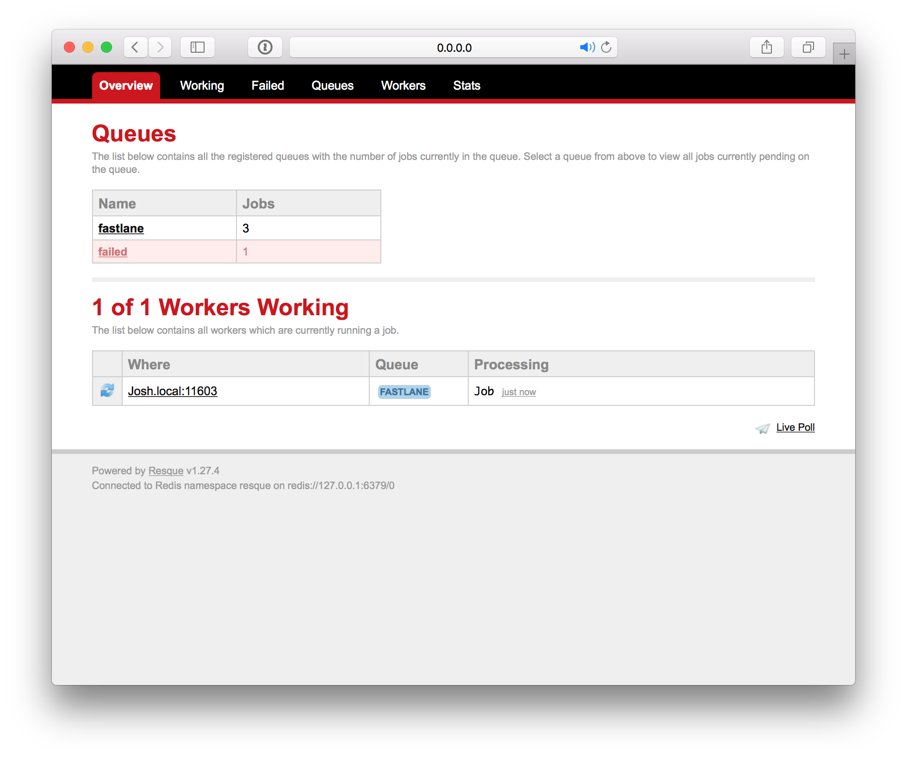
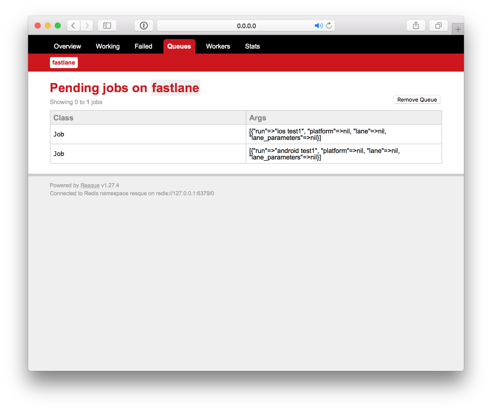
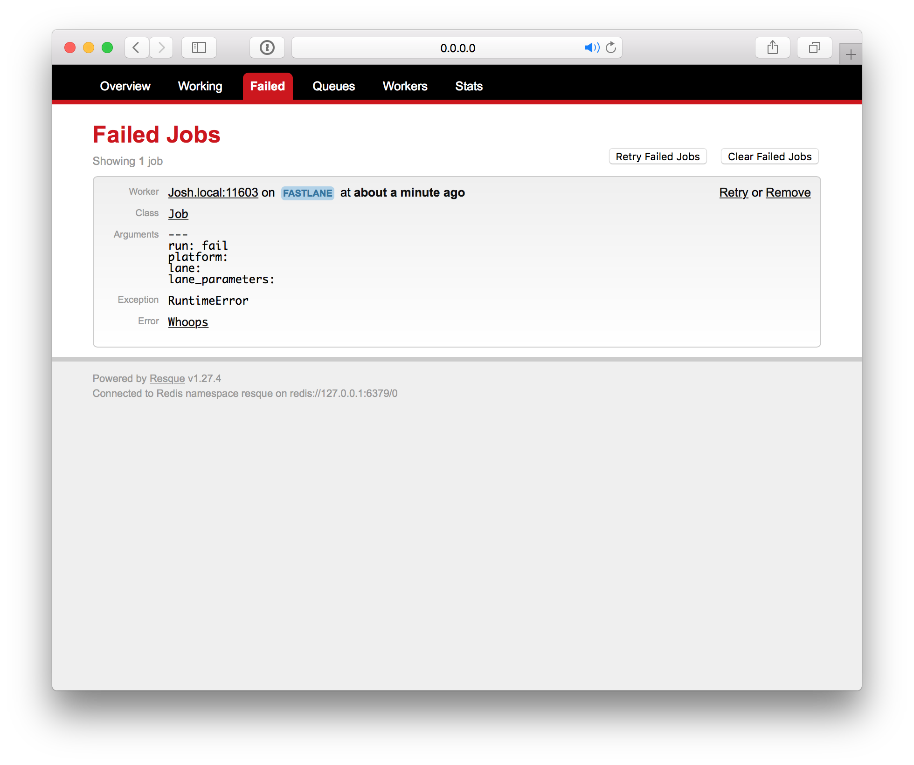

# queue plugin

[](https://rubygems.org/gems/fastlane-plugin-queue)

## Getting Started

This project is a [_fastlane_](https://github.com/fastlane/fastlane) plugin. To get started with `fastlane-plugin-queue`, add it to your project by running:

```bash
fastlane add_plugin queue
```

This plugin also require [Redis](https://redis.io). Install using `brew install redis` or instructions [here](https://redis.io/download)

## About queue

Easily add a [Resque](https://github.com/resque/resque) queue system to your fastlane project.

### Current Features
- Queue any of your lanes into a `resque` queue
- Manage queue using `resque`'s web interface
  - View queued, running, and failed jobs
  - Retry failed jobs

### Planned Features
- Configure any `resque` settings 
  - Ex: port, redis connection settings, plugins
- Custom web interface for starting `fastlane` jobs
- Allow different `dotenv` settings per job





### Step 0 - Start Redis server
Make sure you Redis server is running. This is usually done by running `redis-server` (but this may be different based on how Redis was installed).

### Step 1 - Start queue
Start the queue web server and worker by running the following command. This will be a **blocking** command so you will need to open to open a second terminal window/tab to add your fastlane jobs to the queue. To kill the web server and worker, you will need to hit `CONTROL + C`.
```rb
fastlane run start_queue
```

### Step 2 - Add to queue
The easiest way to add a job to a queue is to run the `queue` action direction using the following command. The `run` parameter will run anything you would put after the "fastlane" command you would usually run. Below are some examples:
```rb
fastlane run queue run:"ios deploy"
```

```rb
fastlane run queue run:"android deploy"
```

```rb
fastlane run queue run:"build"
```

```rb
fastlane run queue run:"ios beta group:staging"
```

## Advanced
It is possible add fastlane jobs to your queue by using standard fastlane syntax by adding `queue:true` (see below)

```sh
fastlane ios beta queue:true
```

To do this, add the following setup in your `Fastfile`...

```rb
before_all do |lane, options|
  if options[:queue]
    queue(
      platform: Actions.lane_context[Actions::SharedValues::PLATFORM_NAME],
      lane: lane.to_s,
      lane_parameters: options
    )
    UI.abort_with_message! "We queued this so not running"
  end
end
```

This will abort the fastlane process before any of the lanes can get called but **will** add a job to the queue platform, lane, and parameters that you specified in your command.

## Example

Check out the [example `Fastfile`](fastlane/Fastfile) to see how to use this plugin. Try it by cloning the repo, running `fastlane install_plugins` and `bundle exec fastlane test`.

## Run tests for this plugin

To run both the tests, and code style validation, run

```
rake
```

To automatically fix many of the styling issues, use
```
rubocop -a
```

## Issues and Feedback

For any other issues and feedback about this plugin, please submit it to this repository.

## Troubleshooting

If you have trouble using plugins, check out the [Plugins Troubleshooting](https://docs.fastlane.tools/plugins/plugins-troubleshooting/) guide.

## Using _fastlane_ Plugins

For more information about how the `fastlane` plugin system works, check out the [Plugins documentation](https://docs.fastlane.tools/plugins/create-plugin/).

## About _fastlane_

_fastlane_ is the easiest way to automate beta deployments and releases for your iOS and Android apps. To learn more, check out [fastlane.tools](https://fastlane.tools).
